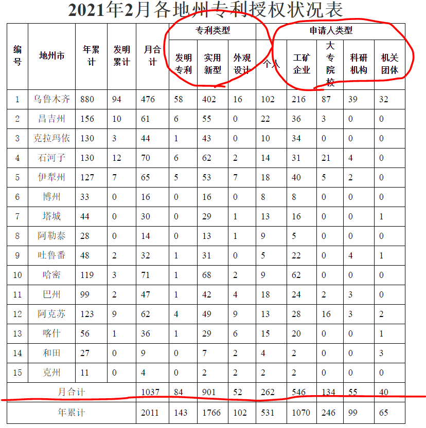
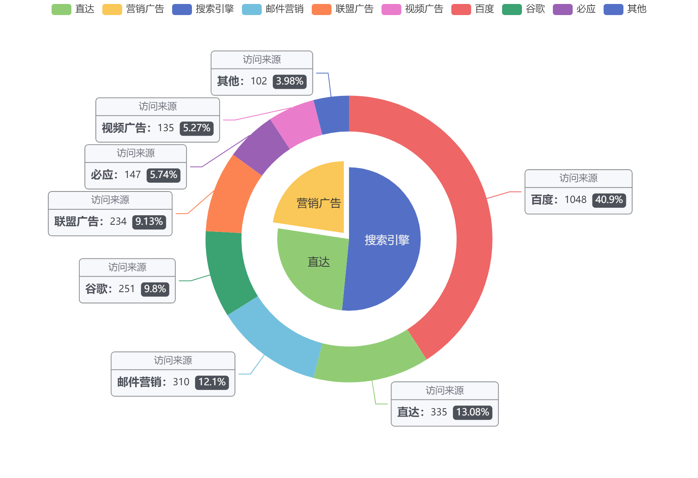
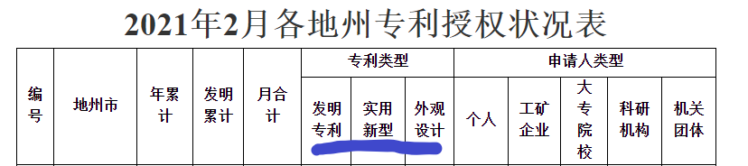
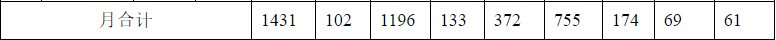
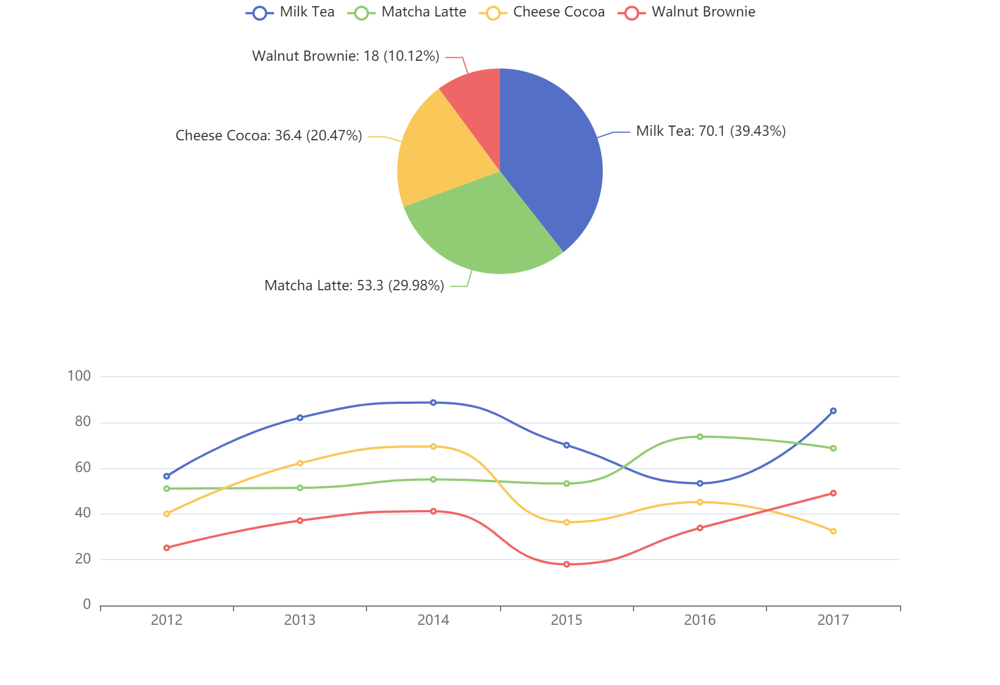
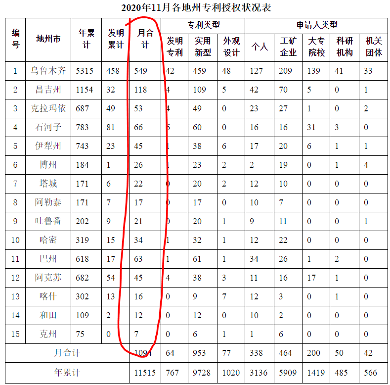
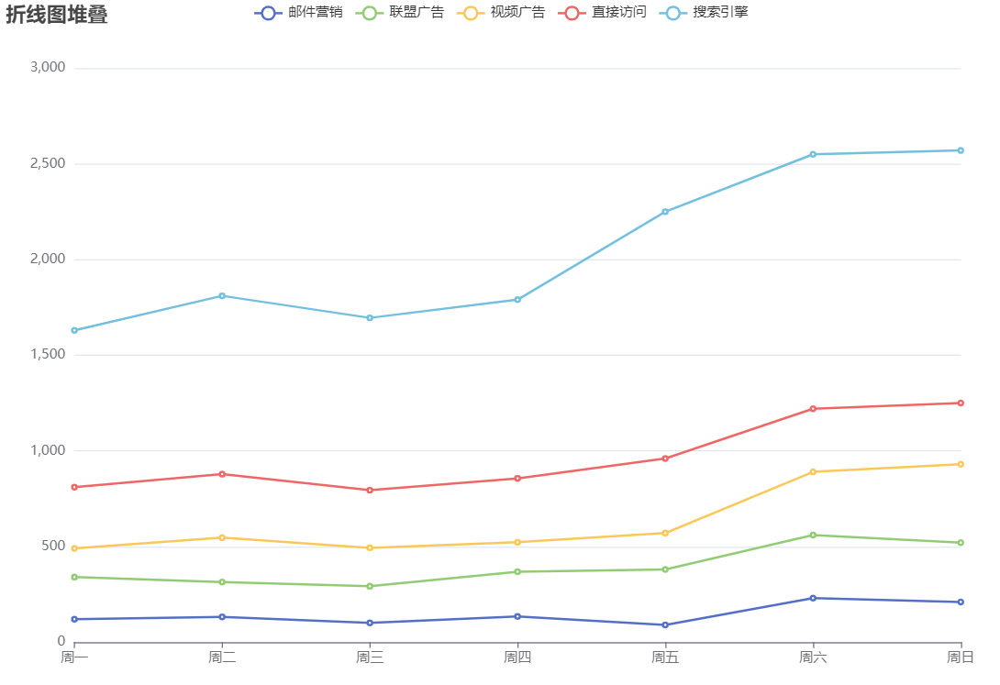
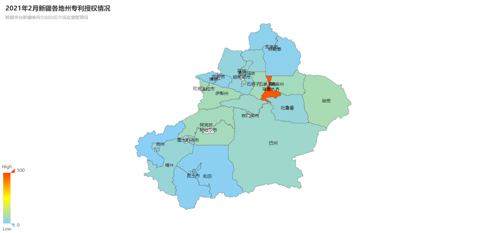

# 开发问题

- [ ] 待解决的问题1：图表中点击要能跳转到相应的数据

比如点击词语“企业”，会跳转到一个数据搜索入口，默认搜索词为“企业”

# 专利相关数据可视化

## 0. 专利相关知识

专利分为三种：发明、实用新型、外观设计

1. 申请专利数：即在统计期间，向专利局提交的申请数量，包括发明、实用新型和外观设计。
2. 发明专利申请数：即在统计期间，上述申请专利数中的发明的申请数。
3. 有效发明专利数：即在统计期间，维持有效的发明专利数。

发明专利保护期长达二十年。有效发明专利，指的是维持有效的发明专利，因此包括了前溯二十年的已经授权且交了年费维持有效的发明专利。这与前面的“发明专利申请数“是不同的统计基准。如果想表达某段时间申请的发明的结案情况，比如有多少申请得到了授权，我们一般用**授权发明专利数**来表达。

反正都是新疆相关的数据，就不指定地名了

## 1. 按月统计新疆专利授权状况

组件名：PatentPie.vue

相关echarts参考

https://echarts.apache.org/examples/zh/editor.html?c=pie-nest

使用嵌套环形图，加上富文本说明。

## 2. 新疆三种专利每月申请受理趋势变化

组件名：PatentLine.vue

相关echarts参考

https://echarts.apache.org/examples/zh/editor.html?c=dataset-link

横轴为时间（月份），曲线为每种专利月合计数量随时间的变化趋势

## ~~3. 各地的有效发明专利拥有量变化(数量变化趋势太不明显，废弃)~~

## 3. **各地州专利授权状况年累计变化**

组件名：PatentLineRace.vue

数据为一年内的各地月合计数据

相关echarts参考：https://echarts.apache.org/examples/zh/editor.html?c=line-stack

## 4. 可视化地图

组件名：PatentMap.vue

可以进一步优化，比如加上更细致的富文本说明