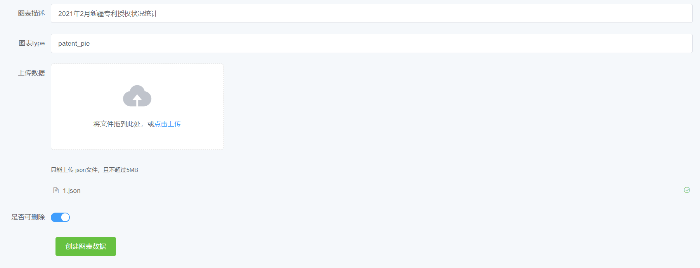
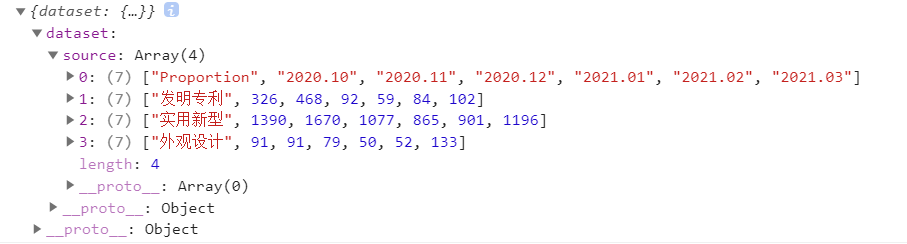

# 1. 数据项目编辑功能
## 1.1 功能概述

本质上是维护图表数据，增删查改

使用Django REST framework

创建了一个新的应用：files

负责文件的上传与下载


## 1.2 表设计

| id（int） | name（varchar）                                              | type(varchar)            | file（varchar）                      | can_del    |
| --------- | ------------------------------------------------------------ | ------------------------ | ------------------------------------ | ---------- |
| 自增id    | 图表的描述，用于前端显示图表标题。例：2021年2月新疆专利授权状况统计 | 图表类型，例如patent_pie | 下载图表数据（以JSON格式存储）的路径 | 能否被删除 |


## 1.3 接口设计

### 1.3.1 文件上传

```
POST /storage/files/
```

不知道怎么描述，反正就是用element自带的示例上传的，见Manage.vue



返回一个对象，包含一条数据的所有信息

```js
{"id":25,"name":"1","type":"1","file":"http://localhost:8000/storage/files/uploads/1_AqYSNrJ.json","can_del":true}
```


### 1.3.2 文件下载

```
GET /storage/files/[id]/download/ 
```

传入id下载数据

上传JSON文件返回一个对象

打印response.data，长这样




### 1.3.3 获取所有文件信息

```html
GET /storage/files/
```


```
HTTP 200 OK
Allow: GET, POST, HEAD, OPTIONS
Content-Type: application/json
Vary: Accept

[
    {
        "id": 12,
        "name": "2021年2月新疆专利授权状况统计",
        "type": "patent_pie",
        "file": "http://localhost:8000/storage/files/uploads/1_aYEpDPe.json",
        "can_del": true
    },
]
```


# 2. 生成数据卡片功能
类似于echarts的演示功能
用户自己上传一个excel
选择两列数据
生成折线图 or 饼图