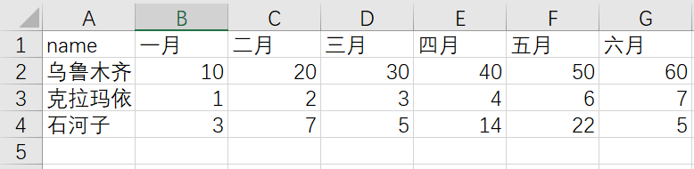
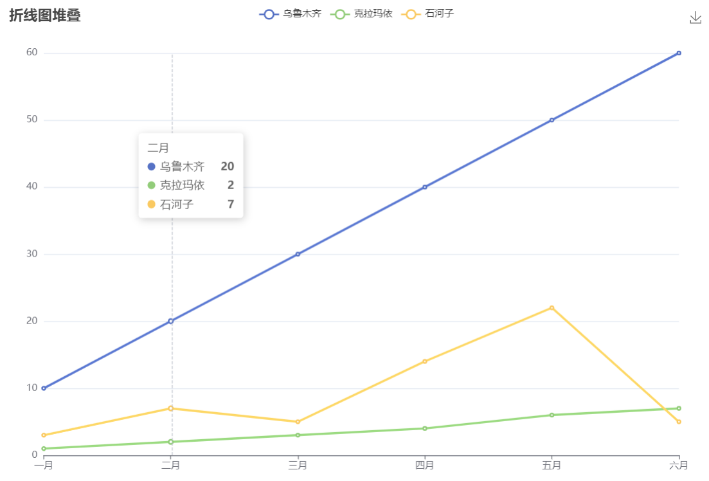
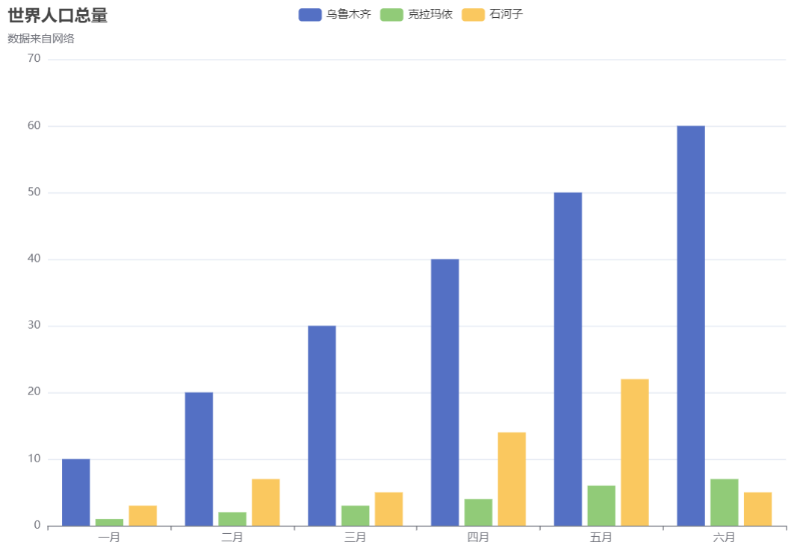
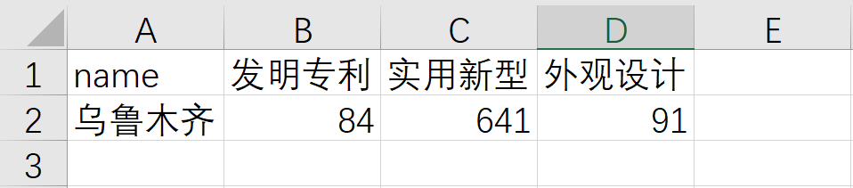
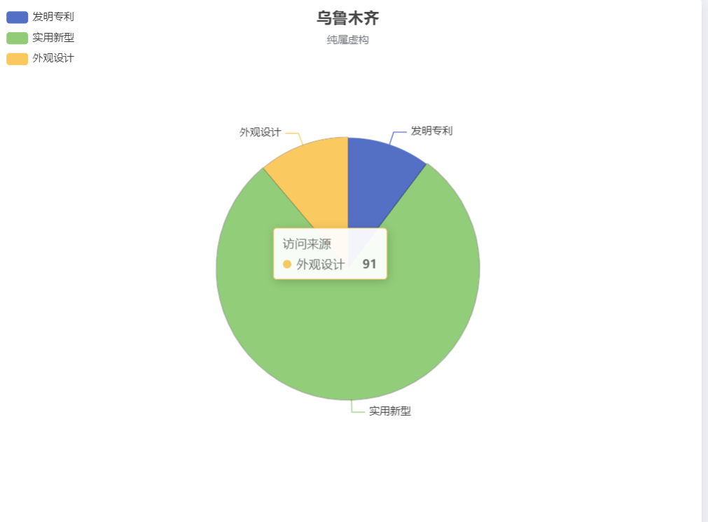

# 接口实现

2021.08.18 更新

数据管理请使用django自带后台：http://127.0.0.1:8000/admin/

账号：admin

密码：123456


## 1. 关系型数据表设计

**表1 数据项目表chart_info**

| 字段 | 数据类型 | 备注 |
| ---- | ---- | ---- |
|  id 	    |  Int    |   自增id   |
|   name   |   String   |   图表在网页上的描述名称   |
| type  |  Int  |  图表类型编号，已有图标以目前的编号为准 |
| display |   Boolean | 是否展示 |
| removable |   Boolean | 是否可删除 |
|x_coordinate| int | 图表的x轴坐标 |
|y_coordinate| int | 图表的y轴坐标 |
|width	| int | 图表的宽度|
|height	| int | 图表的高度|

**表2 文件上传历史信息表 file_history**

| 字段 | 数据类型 | 备注 |
| ---- | ---- | ---- |
|  id 	    |  int   |   自增id   |
| chart	| ForeighKey |数据对应的图表，采用主键orHyperLink连接|
|timestamp | DateField |   文件上传的时间戳|
|file_url | String | 上传文件（json or xlsx）在服务器端的路径 |


**UML图**


## 2. 接口设计思路

暂计划以使用基于类的视图编写我们的API视图，熟悉DRF之后再精简代码

接口实现的思路：

- [x] **1）根据数据项目ID 获得样式编号与最新的history数据**

RESTful接口， single get，重写API上的get方法。

- [x] **2）获取数据大屏的当前状态：`[{x, y, w, h, i:项目ID}, ...]`** 

查询Chart表中display为true的所有数据，并返回相关字段

- [x] **3）更新数据大屏的当前状态：上传的数据：`[{x, y, w, h, i:项目ID}, ...]`**

进行批量部分更新，先根据id查询，再进行部分数据的更细

**4）数据项目的增删查改**

- [x] 4.1 根据数据项目ID 获得数据项目详情

```json
  {
  	"id": "123",
      "name": "A Name",
      "history": [
      	{"timestamp": "时间戳，一串数字", "json": "json文件的位置"},
  		//...
      ],
  	"type": 1, //图表类型编号，已有图表以现在的编号为准吧。
  	"display": true, //true为展示，false为不展示。新添加的放在左下角（也就是x=0，y为所有卡片的最低坐标。
  	"removable": false, //不可删除
  }
```

 - [x] 4.2 增加 

RESTful接口， single post

 - [x] 4.3删除

根据数据项目ID 删除数据项目：**务必**再做一次检查是否可以删除

RESTful接口， single delete，重写API上的destroy方法。

- [x] 4.4 查所有

获取所有数据项目：`[{id, name}, ...]`

RESTful接口，get list，只返回id和name字段

- [x] 4.5 完整更新与部分更新

RESTful接口，single put, single patch

**5) json文件上传/下载**

- [x] 5.1 根据数据项目ID 上传新数据内容
- [x] 5.2 根据数据项目ID和时间戳下载文件（json/xlsx）
- [x] 5.3 根据数据项目ID和时间戳解析数据内容

## 3. HTTP接口文档

接口文档：https://docs.apipost.cn/preview/0a52cb8f403e1526/593aa8aa8b3baccb


## 4. 自定义图表部分的设计

暂定
- type=8：代表自定义折线图
- type=9：代表自定义柱状图
- type=10:  代表自定义饼图

### 4.1 自定义折线图

excel格式示例：

第一行为x轴，第一列为数据名，每一行为一条折线图的数值型数据。



参考数据来源：http://www.xjaic.gov.cn/xjaic/tzgg/202108/cb514549a8304e9d8046b53a2d4681d7.shtml

前端代码参考示例：

https://echarts.apache.org/examples/zh/editor.html?c=line-stack


将excel数据解析后打包为一个json返回前端

```json
{
	"xAxis_data": [
		"一月",
		"二月",
		"三月",
		"四月",
		"五月",
		"六月"
	],
	"series": [
		{
			"type": "line",
			"name": "乌鲁木齐",
			"data": [
				10,
				20,
				30,
				40,
				50,
				60
			]
		},
		{
			"type": "line",
			"name": "克拉玛依",
			"data": [
				1,
				2,
				3,
				4,
				6,
				7
			]
		},
		{
			"type": "line",
			"name": "石河子",
			"data": [
				3,
				7,
				5,
				14,
				22,
				5
			]
		}
	],
	"legend": {
		"data": [
			"乌鲁木齐",
			"克拉玛依",
			"石河子"
		]
	}
}
```

图表预览




### 4.2 自定义柱状图

前端代码参考示例：

https://echarts.apache.org/examples/zh/editor.html?c=bar-y-category

excel格式示例：


将excel数据解析后打包为一个json返回前端

```json
{
	"xAxis_data": [
		"一月",
		"二月",
		"三月",
		"四月",
		"五月",
		"六月"
	],
	"series": [
		{
			"type": "bar",
			"name": "乌鲁木齐",
			"data": [
				10,
				20,
				30,
				40,
				50,
				60
			]
		},
		{
			"type": "bar",
			"name": "克拉玛依",
			"data": [
				1,
				2,
				3,
				4,
				6,
				7
			]
		},
		{
			"type": "bar",
			"name": "石河子",
			"data": [
				3,
				7,
				5,
				14,
				22,
				5
			]
		}
	],
	"legend": {
		"data": [
			"乌鲁木齐",
			"克拉玛依",
			"石河子"
		]
	}
}
```

图表预览


### 4.3 自定义饼图

前端代码参考示例：

https://echarts.apache.org/examples/zh/editor.html?c=pie-simple

excel格式示例：



将excel数据解析后打包为一个json返回前端
```json
{
	"name": "乌鲁木齐",
	"series": [
		{
			"name": "发明专利",
			"value": 84
		},
		{
			"name": "实用新型",
			"value": 641
		},
		{
			"name": "外观设计",
			"value": 91
		}
	]
}
```

图表预览
